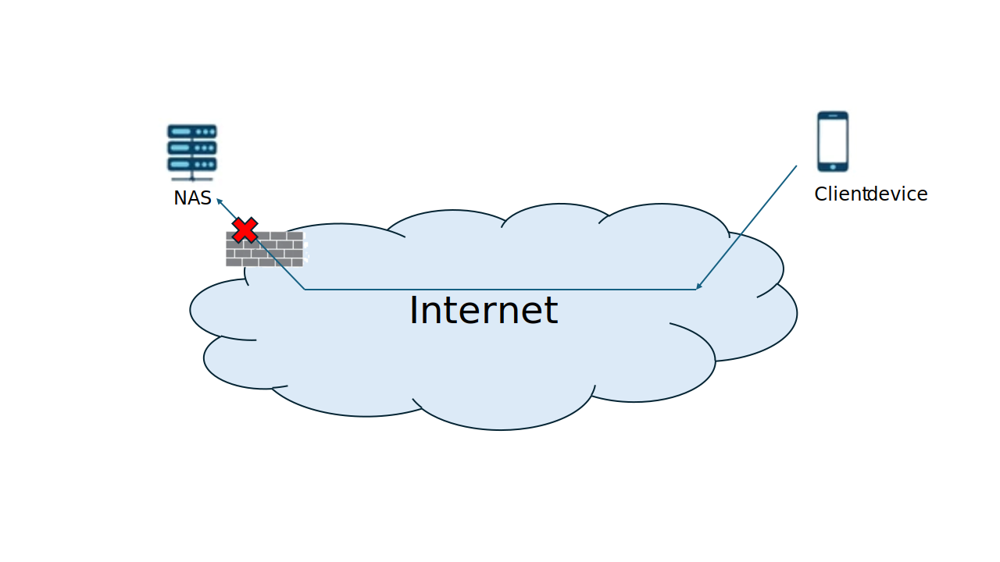
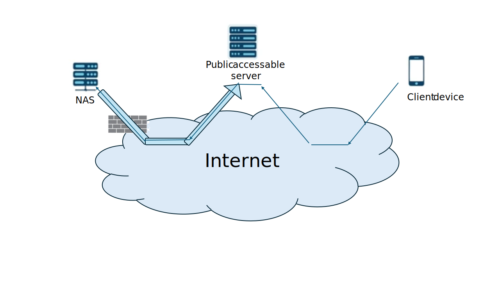
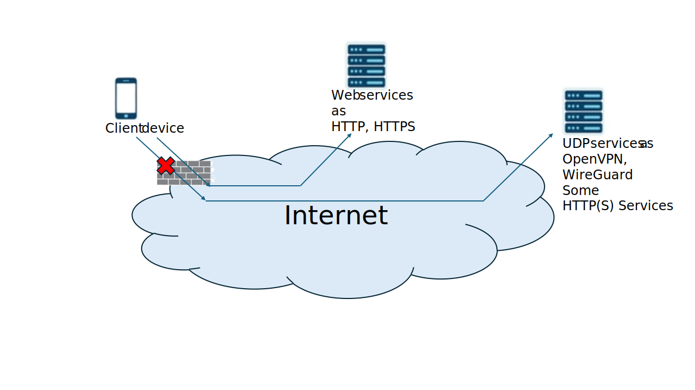
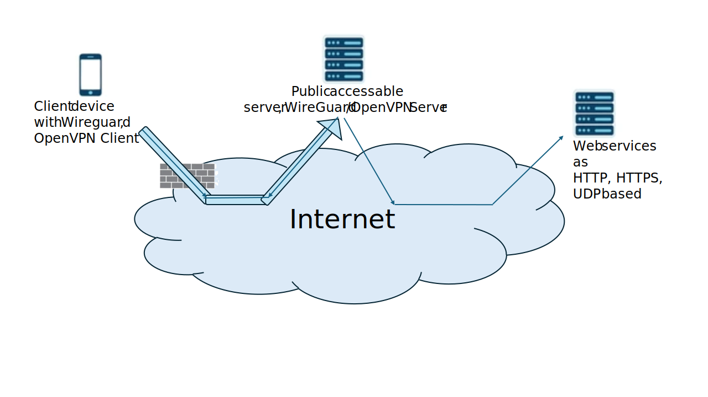
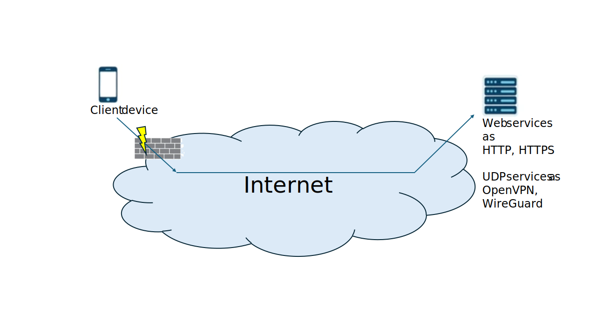
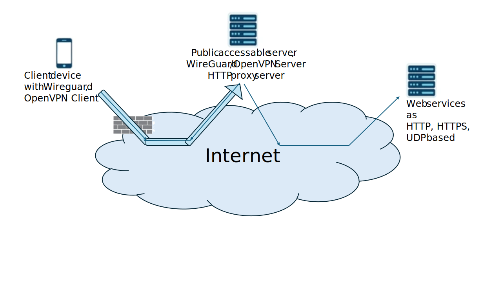

# ObstacleBridge
ObstacleBridge is a Python-based overlay and channel-multiplexing toolkit for barrier-resilient networking. It can run over multiple overlay transports (`myudp`, `tcp`, `quic`, `ws`), expose local TCP/UDP listener services through a reliable overlay, and host an admin UI for monitoring active channels.

## Similar projects
- [chisel](https://github.com/jpillora/chisel) — a well-known TCP/UDP tunnel over HTTP/WebSocket implemented in Go.

## Why this project was developed
- `chisel` is implemented in Go, and using/building it on Synology NAS environments can be difficult in practice.
- ObstacleBridge adds the `myudp` transport to better handle network obstacles and traffic degradation conditions seen in large-scale Asian network environments.

## Repository layout
- `src/obstacle_bridge/` — main implementation.
- `tests/unit/` — targeted unit tests.
- `tests/integration/` — end-to-end and subprocess tests.
- `scripts/` — development helpers.
- `docs/ObstacleBridge Client.html` — exported example of the admin web UI on a peer/client instance. Rendered preview: `https://htmlpreview.github.io/?https://raw.githubusercontent.com/ohnoohweh/briidge_lossy/main/docs/ObstacleBridge%20Client.html`
- `docs/ObstacleBridge Server.html` — exported example of the admin web UI on a listener/server instance. Rendered preview: `https://htmlpreview.github.io/?https://raw.githubusercontent.com/ohnoohweh/briidge_lossy/main/docs/ObstacleBridge%20Server.html`
- `docs/WHITEPAPER.html` — full whitepaper requested for this repository update. Rendered preview: `https://htmlpreview.github.io/?https://raw.githubusercontent.com/ohnoohweh/briidge_lossy/main/docs/WHITEPAPER.html`
- `wireshark/` — Wireshark dissectors grouped by framing/version.
## Entry points
- `python -m obstacle_bridge --help`

## Integration reconnect suite
- `python tests/integration/test_overlay_e2e.py` runs the common/default overlay suite path.
- `python tests/integration/test_overlay_e2e.py --mode reconnect` keeps the reconnect regression workflow available as an explicit override.
- `RUN_OVERLAY_E2E=1 pytest -q tests/integration/test_overlay_e2e.py -k reconnect` runs the same reconnect path via pytest.
- `--reconnect-timeout` can be used to tune connected/disconnected transition waits.
- Additional test-suite usage details are documented in `docs/README_TESTING.md`.

## Quick-start examples
### 1) NAS (network attached storage) behind outbound-only internet, reached through a public server
This example fits a common home or small-office setup:

- The NAS can make outgoing internet connections, but incoming connections to the NAS are blocked.
- The NAS may only have usable IPv4 internet access.
- The client device may only have IPv6 connectivity.
- The NAS still needs to offer services such as SSH (TCP/22), HTTP (TCP/80), HTTPS (TCP/443), plus a private admin web UI on TCP/18080.

Direct access fails because the NAS is not reachable from the outside and the two sides may not even share the same usable address family. The workaround is to place a small public VPS (Virtual Private Server) in the middle, for example a rented server on `ishosting.com`, and let the NAS keep one outgoing overlay session open to that server.

Issue before ObstacleBridge:



Solution with a public ObstacleBridge server:



**Public dual-stack VPS running the ObstacleBridge listener**
```bash
python -m obstacle_bridge \
  --overlay-transport myudp \
  --udp-bind :: \
  --udp-own-port 4443 \
  --admin-web \
  --admin-web-bind 127.0.0.1 \
  --admin-web-port 18080 \
  --log INFO
```

This public server should have working IPv4 and IPv6 reachability and be reachable by DNS name such as `bridge.example.com`.

**NAS running as peer client and asking the public server to publish NAS services**
```bash
python -m obstacle_bridge \
  --overlay-transport myudp \
  --udp-peer bridge.example.com \
  --udp-peer-port 4443 \
  --udp-own-port 0 \
  --admin-web \
  --admin-web-bind 127.0.0.1 \
  --admin-web-port 18081 \
  --remote-servers "tcp,18022,::,tcp,127.0.0.1,22 tcp,80,::,tcp,127.0.0.1,80 tcp,443,::,tcp,127.0.0.1,443 tcp,18081,::,tcp,127.0.0.1,18080" \
  --log INFO
```

**Offered VPS port mapping for this setup**

| VPS Port | Description | Destination | Destination Port |
|---:|---|---|---:|
| TCP:22 | VPS SSH | VPS | TCP:22 |
| TCP:80 | NAS HTTP | NAS | TCP:80 |
| TCP:443 | NAS HTTPS | NAS | TCP:443 |
| UDP:4433 | ObstacleBridge UDP peer communication | VPS | UDP:4443 |
| TCP:18022 | NAS SSH (published by VPS) | NAS | TCP:22 |
| TCP:18080 | Admin web (VPS listener instance) | VPS | TCP:18080 |
| TCP:18081 | Admin web (NAS peer instance, published by VPS) | NAS | TCP:18080 |

How this works:

- The NAS opens one outgoing `myudp` overlay connection to the public server.
- `--remote-servers` tells the public server to listen on TCP/18022, TCP/80, TCP/443, and TCP/18081.
- Connections arriving on the public server are forwarded over the overlay to the NAS-local targets on `127.0.0.1`.
- The NAS admin web still runs on `127.0.0.1:18080`, while the VPS keeps its own admin web on `127.0.0.1:18080`; exposing NAS admin as TCP/18081 on the VPS avoids collisions.
- Using `::` for exposed listener binds allows dual-stack socket behavior on VPS environments that support IPv4-mapped IPv6 sockets.

### 2) WireGuard bridge setup through inspected internet access
This example fits a censorship or heavy-content-inspection environment:

- A large upstream network operator blocks or degrades access to many sites and services outside the country.
- UDP-based VPNs such as WireGuard and UDP OpenVPN do not reach public servers directly.
- Some outbound HTTP or HTTPS traffic still passes the obstacle.
- A public server outside the restricted network can run ObstacleBridge and a WireGuard or OpenVPN server.

In that situation, ObstacleBridge can carry traffic over a WebSocket overlay using binary frames on top of HTTP(S)-reachable connectivity. That lets a local WireGuard or OpenVPN client reach a server outside the filtered network, with one important tradeoff:

- VPN over WebSocket means TCP over TCP tunneling, which is convenient and often effective, but not ideal for every workload.
- For plain HTTP(S) browsing, a dedicated HTTP proxy such as SQUID can avoid that TCP-over-TCP penalty and may be the better tool.

Issue before ObstacleBridge:



Solution with an ObstacleBridge WebSocket bridge:



This quick start assumes:

- the public bridge server can already reach a local WireGuard UDP service on `127.0.0.1:16666`
- the restricted-side client can reach `https://bridge.example.com` or `ws://bridge.example.com`
- the client wants to recreate the same WireGuard UDP port locally on `127.0.0.1:16666`

**Public bridge server with WebSocket overlay**
```bash
python -m obstacle_bridge \
  --overlay-transport ws \
  --ws-bind 0.0.0.0 \
  --ws-own-port 443 \
  --log INFO
```
This public bridge server must be reachable by clients at DNS name `bridge.example.com` and should normally sit behind a firewall rule or reverse-proxy setup that allows WebSocket traffic on port `443`.

**Restricted-side peer that recreates the WireGuard UDP port locally**
```bash
python -m obstacle_bridge \
  --overlay-transport ws \
  --ws-peer bridge.example.com \
  --ws-peer-port 443 \
  --ws-own-port 0 \
  --own-servers "udp,16666,127.0.0.1,udp,127.0.0.1,16666" \
  --log INFO
```

With that peer command running, a local WireGuard client can use `127.0.0.1:16666` as its endpoint. ObstacleBridge accepts the local UDP packets, carries them through the WebSocket overlay, and forwards them to the WireGuard server reachable from the public bridge host.

How this helps:

- the obstacle only sees outbound WebSocket-over-HTTP(S) traffic instead of raw WireGuard or OpenVPN UDP
- the local VPN client keeps talking to a normal UDP endpoint on `127.0.0.1:16666`
- once the VPN comes up, other applications can use the VPN tunnel normally

Operational note:

- if the network still allows direct UDP to the public bridge, prefer the `myudp` or native UDP overlay examples instead
- use the WebSocket version when HTTP(S)-shaped traffic is what reliably survives the inspection system

### 3) WireGuard bridge setup for high-loss obstacle conditions in Asia
This example fits a different obstacle pattern than the inspected WebSocket-only path above:

- A very large country in Asia artificially drops internet frames and triggers excessive retransmissions.
- Conventional transports slow down so much under loss that the connection becomes nearly unusable.
- UDP itself may still pass, but with heavy loss and jitter.
- A public server outside the degraded network can run ObstacleBridge and a WireGuard or OpenVPN server.

In this situation, the `myudp` overlay is designed to cope much better with packet loss than a conventional TCP-style transport. That makes it a practical carrier for a local WireGuard or OpenVPN client that still needs full internet access for arbitrary applications.

Issue before ObstacleBridge:



Solution with an ObstacleBridge `myudp` bridge:



This quick start assumes:

- the public bridge server can already reach a local WireGuard UDP service on `127.0.0.1:16666`
- the restricted-side client can still send UDP to `bridge.example.com`
- the network path is lossy enough that ordinary protocols degrade badly, but `myudp` remains workable

**Public bridge server with `myudp` overlay**
```bash
python -m obstacle_bridge \
  --overlay-transport myudp \
  --udp-bind 0.0.0.0 \
  --udp-own-port 4433 \
  --log INFO
```

**Restricted-side peer that recreates the WireGuard UDP port locally**
```bash
python -m obstacle_bridge \
  --overlay-transport myudp \
  --udp-peer bridge.example.com \
  --udp-peer-port 4433 \
  --udp-own-port 0 \
  --own-servers "udp,16666,127.0.0.1,udp,127.0.0.1,16666" \
  --log INFO
```

With that peer command running, a local WireGuard or UDP OpenVPN client can use `127.0.0.1:16666` as its endpoint. ObstacleBridge accepts the local UDP packets, carries them through the lossy `myudp` overlay, and forwards them to the VPN server reachable from the public bridge host.

How this helps:

- `myudp` is intended for paths with loss, jitter, and obstacle-induced retransmission pressure
- the local VPN client still talks to a normal UDP endpoint on `127.0.0.1:16666`
- once the VPN comes up, all applications can use the VPN tunnel normally

Operational note:

- prefer this `myudp` setup when outside UDP is available but the path is extremely lossy
- prefer the WebSocket example above when only HTTP(S)-shaped traffic reliably survives the obstacle

### 4) Peer client setup for both inspected and high-loss paths
```bash
python -m obstacle_bridge \
  --overlay-transport ws,myudp \
  --ws-peer bridge.example.com --ws-peer-port 443 \
  --ws-own-port 0 \
  --udp-peer bridge.example.com --udp-peer-port 4433 \
  --udp-own-port 0 \
  --own-servers "udp,16666,127.0.0.1,udp,127.0.0.1,16666"
```
This combines the peer-side ideas from examples 2 and 3 in one command:

- `ws` is available for environments where only HTTP(S)-shaped traffic survives reliably
- `myudp` is available for environments where UDP still passes but the path is highly lossy
- the local WireGuard or OpenVPN client still talks to `127.0.0.1:16666`

Using `--ws-own-port 0` and `--udp-own-port 0` requests dynamic local source-port assignment by the OS for outgoing overlay traffic.
## CLI parameter reference
The tables below are generated from the current parser registrations in `bridge.py`, so the defaults and descriptions match the live code.
### General / status
| Option(s) | Default | Description |
|---|---:|---|
| `--status` | `True` | enable periodic status (default: on) |
| `--no-dashboard` | `False` | disable non-scrolling dashboard (print multiline blocks instead) |

### UDP overlay
| Option(s) | Default | Description |
|---|---:|---|
| `--udp-bind` | `::` | overlay bind address (IPv4 '0.0.0.0' or IPv6 '::') |
| `--udp-own-port` | `4433` | UDP overlay own port |
| `--udp-peer` | `None` | peer IP/FQDN (IPv4 or IPv6 literal; IPv6 may be in [brackets]) |
| `--udp-peer-port` | `443` | peer overlay port |
| `--peer-resolve-family` | `prefer-ipv6` | Peer name resolution policy: prefer IPv6 then IPv4, IPv4 only, or IPv6 only. |
| `--max-inflight` | `32767` | max DATA frames allowed in flight (1..32767). Excess frames are queued. |
| `--peer` | alias of `--udp-peer` | backwards-compatible alias |
| `--peer-port` | alias of `--udp-peer-port` | backwards-compatible alias |

### WebSocket overlay
| Option(s) | Default | Description |
|---|---:|---|
| `--ws-path` | `/` | WebSocket HTTP path (default /) |
| `--ws-bind` | `::` | WS overlay bind address |
| `--ws-own-port` | `8080` | WS overlay own port |
| `--ws-peer` | `None` | WS peer IP/FQDN |
| `--ws-peer-port` | `8080` | WS peer overlay port |
| `--ws-subprotocol` | `None` | Optional WebSocket subprotocol (e.g. mux2) |
| `--ws-tls` | `False` | Use TLS (wss://). Provide cert/key via your deployment. |
| `--ws-max-size` | `65535` | Maximum binary message size to accept/send (default 65535). |
| `--ws-payload-mode` | `binary` | WebSocket payload transfer mode: raw binary frames (default), base64 text frames, or JSON text frames with the base64 payload in the data field. |
| `--ws-static-dir` | `./web` | Directory to serve as a static web root on the WS port (default ./web). Set to '' to disable. |
| `--ws-send-timeout` | `3.0` | Seconds to wait for a WebSocket frame send before forcing reconnect (default 3.0). |
| `--ws-tcp-user-timeout-ms` | `10000` | TCP_USER_TIMEOUT in milliseconds for WebSocket sockets (default 10000, 0 disables). |
| `--ws-reconnect-grace` | `3.0` | Seconds to wait before reporting DISCONNECTED after WS transport loss (default 3.0). |

### TCP overlay
| Option(s) | Default | Description |
|---|---:|---|
| `--tcp-bp-wbuf-threshold` | `131072` | TCP overlay: write() buffer size threshold in bytes to signal drain (default 131072). |
| `--tcp-bind` | `::` | TCP overlay bind address |
| `--tcp-own-port` | `8081` | TCP overlay own port |
| `--tcp-peer` | `None` | TCP peer IP/FQDN |
| `--tcp-peer-port` | `8081` | TCP peer overlay port |
| `--tcp-bp-latency-ms` | `300` | TCP overlay: if > 0, trigger drain after this latency (ms) whenever pending bytes exist. |
| `--tcp-bp-poll-interval-ms` | `50` | TCP overlay: polling interval for time-based backpressure checks (ms; default 50). |

### QUIC overlay
| Option(s) | Default | Description |
|---|---:|---|
| `--quic-alpn` | `hq-29` | ALPN protocol ID (default hq-29) |
| `--quic-bind` | `::` | QUIC overlay bind address |
| `--quic-own-port` | `443` | QUIC overlay own port |
| `--quic-peer` | `None` | QUIC peer IP/FQDN |
| `--quic-peer-port` | `443` | QUIC peer overlay port |
| `--quic-cert` | `None` | Server certificate file (PEM) |
| `--quic-key` | `None` | Server private key file (PEM) |
| `--quic-insecure` | `False` | Client: disable certificate verification (TEST ONLY) |
| `--quic-max-size` | `65535` | Maximum app message size accepted/sent (default 65535). |

### Channel mux
| Option(s) | Default | Description |
|---|---:|---|
| `--own-servers` | `None` | Space-separated service specs (client mode only): 'proto,listen_port,listen_bind,proto,host,port' (quoted). Listener instances ignore --own-servers because multiple overlay peers make the target ambiguous. Example: "tcp,80,0.0.0.0,tcp,127.0.0.1,88 udp,16666,::,udp,127.0.0.1,16666" |
| `--remote-servers` | `None` | Space-separated service specs with the same format as `--own-servers`, but applied to the connected overlay peer via mux control signaling (reverse behavior of `--own-servers`). Example: "udp,16666,0.0.0.0,udp,127.0.0.1,16666 tcp,3128,0.0.0.0,tcp,127.0.0.1,3128". |
| `--mux-tcp-bp-threshold` | `1` | Mux TCP: size threshold (bytes) to trigger drain() (default 1). |
| `--mux-tcp-bp-latency-ms` | `300` | Mux TCP: if > 0, drain writers after this ms when bytes pending. |
| `--mux-tcp-bp-poll-interval-ms` | `50` | Mux TCP: polling interval for time-based backpressure (ms). |

#### Reverse service publishing with `--remote-servers`

`--remote-servers` lets one peer ask the connected peer to expose listeners and bridge them to peer-local targets.

```bash
--remote-servers "udp,16666,0.0.0.0,udp,127.0.0.1,16666 tcp,3128,0.0.0.0,tcp,127.0.0.1,3128"
```

Expected behavior:

- On connected peer: bind UDP listener on `0.0.0.0:16666`, and connect forwarded UDP channel to `127.0.0.1:16666`.
- On connected peer: bind TCP listener on `0.0.0.0:3128`, and connect forwarded TCP channel to `127.0.0.1:3128`.
- Initiating peer sends a dedicated mux control command after overlay connection so the remote side can install or refresh the requested service catalog.

### Admin web
| Option(s) | Default | Description |
|---|---:|---|
| `--admin-web` | `True` | Enable admin web interface |
| `--admin-web-bind` | `127.0.0.1` | Bind address for admin web interface |
| `--admin-web-port` | `18080` | Port for admin web interface |
| `--admin-web-path` | `/` | Base path for admin web interface |
| `--admin-web-dir` | `./admin_web` | Directory containing admin web files |
| `--admin-web-token` | `` | Optional bearer token for admin restart endpoint |

#### Admin web examples

The repository includes two exported admin web snapshots:

- [docs/ObstacleBridge Client.html](https://htmlpreview.github.io/?https://raw.githubusercontent.com/ohnoohweh/briidge_lossy/main/docs/ObstacleBridge%20Client.html) shows a peer/client-side view.
- [docs/ObstacleBridge Server.html](https://htmlpreview.github.io/?https://raw.githubusercontent.com/ohnoohweh/briidge_lossy/main/docs/ObstacleBridge%20Server.html) shows a listener/server-side view.

Client admin web screenshot:


What the admin web shows:

- A top status badge with the current overlay state, for example `CONNECTED`.
- A summary row with the currently open UDP and TCP channel counts.
- Traffic cards for app-side RX/TX and peer-side RX/TX rates.
- A peer-session table with transport type, RTT estimate, open channel counts, byte counters, inflight frames, and `myudp` confirmation statistics.
- UDP and TCP connection tables that show current mappings, local listening ports, remote endpoints, and per-channel byte/message counters.
- A configuration tab that exposes the live runtime options such as overlay transports, listener ports, `--remote-servers`, admin web settings, and log levels.
- A debug log tab with recent in-memory log lines, which is especially useful while investigating channel setup, backpressure, reconnects, and late-data cases.

What is visible in the included snapshots:

- The client snapshot shows a connected `myudp` peer session, one active UDP service, and TCP listener activity on the peer side where overlay traffic is being delivered back to local sockets.
- The server snapshot shows a public listener role with a connected `myudp` session, an additional idle `ws` listener, and multiple active TCP channels being bridged through the overlay.

### Logging
| Option(s) | Default | Description |
|---|---:|---|
| `--log` | `WARNING` | logging level (default WARNING; try INFO or DEBUG) be aware of --console-level and --file-level |
| `--log-file` | `None` | file path to also write logs enabled by --log |
| `--console-level` | `INFO` | console (stdout) logging level (default INFO) |
| `--file-level` | `DEBUG` | file logging level (default: same as --log) |
| `--debug-stderr` | `False` | mirror DEBUG lines to stderr (default: off) |

### Runner
| Option(s) | Default | Description |
|---|---:|---|
| `--overlay-transport` | `myudp` | Overlay transport between peers: comma-separated list from myudp,tcp,quic,ws. Multiple transports are supported simultaneously for listening instances. |
| `--client-restart-if-disconnected` | `0.0` | If configured as a peer client (for example --udp-peer set) and overlay stays disconnected for this many seconds, request process restart. 0 disables. |

## Whitepaper
The complete whitepaper requested for this project update is available as a rendered preview at [`docs/WHITEPAPER.html`](https://htmlpreview.github.io/?https://raw.githubusercontent.com/ohnoohweh/briidge_lossy/main/docs/WHITEPAPER.html). It covers:
- Internet barriers such as NAT, DPI, protocol blocking, traffic shaping, and TLS interception.
- Transport-level behavior for IP, ICMP, UDP, TCP, QUIC, DNS, HTTP/HTTPS, and WebSockets.
- The layered overlay architecture used here: RTT/liveness, reliable DATA/CONTROL framing, and ChannelMux OPEN/DATA/CLOSE multiplexing.
- Why UDP overlays can outperform TCP-over-TCP tunnels on hostile paths.
- Development-process lessons from AI-supported programming.
### Whitepaper abstract
> This whitepaper presents a detailed technical explanation of Internet communication mechanisms and a Python-based UDP overlay protocol designed to work across restrictive network environments. The report explains how modern Internet barriers such as NAT, IPv4/IPv6 asymmetry, deep packet inspection, protocol blocking, traffic shaping, and throttling affect connectivity, and how a layered UDP overlay can reconstruct connection detection, round-trip-time measurement, loss recovery, retransmission, and multi-channel multiplexing in user space.
### Whitepaper table of contents
1. Introduction  
2. Internet Services and Their Performance Requirements  
3. Routing Fundamentals: Hubs, Switches, Routers, VPN Paths, and the Layer Model  
4. Modern Internet Barriers  
5. Internet Protocol (IP)  
6. ICMP Protocol  
7. UDP Protocol  
8. TCP Protocol  
9. TCP Congestion Control  
10. TCP Backpressure and Flow Control  
11. QUIC Protocol  
12. DNS Protocol  
13. HTTP, HTTPS, and WebSockets  
14. Deep Packet Inspection and TLS Interception  
15. VPNs, HTTP Proxies, and Tunneling  
16. Why a UDP Overlay Helps  
17. Overlay Architecture Overview  
18. Overlay Architecture Overview  
19. Layer 1: Connection Detection and RTT Measurement  
20. Layer 2: Reliable DATA / CONTROL Protocol  
21. Layer 3: ChannelMux OPEN / DATA / CLOSE Protocol  
22. End-to-End Example: Browser via HTTP Proxy over Overlay  
23. Why This Can Improve Performance  
24. Detailed TCP-over-TCP Problem Example  
25. Limitations and Engineering Considerations  
26. Development Procedure and Experience with AI-Supported Programming  
27. Conclusion  
References
## Notes
- Listener mode intentionally ignores `--own-servers`, because a multi-peer listener cannot unambiguously bind one local listener to one remote peer.
- Multi-transport mode is currently intended for listening instances without configured transport peers (for example no `--udp-peer`, `--tcp-peer`, `--quic-peer`, or `--ws-peer`).
- WebSocket listener mode supports multiple simultaneous peers with per-peer mux-channel rewriting so that peer-local channel IDs do not collide inside the shared mux logic.
