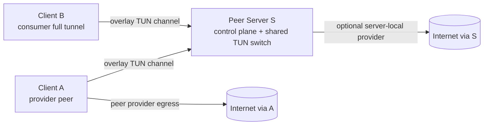

# Shared TUN Providers via Peer Clients

## Goal

This document defines a concept for letting a peer client act as an Internet
egress provider for other peers in a shared TUN fabric.

The motivating topology is:

- `S`: one peer server that remains the rendezvous point, control-plane owner,
  and shared-TUN packet switch
- `A`: one peer client that allows selected peers to use `A`'s Internet uplink
- `B`: one peer client that sends all Internet traffic through `A`
- `S` may still share its own Internet uplink, matching the server-exit model
  that exists today

The intended result is:

- `B -> S -> A -> Internet via A`
- and, at the same time, `other peer -> S -> Internet via S` remains possible

This is a server-mediated design. It is not a direct mesh between `A` and `B`,
and it is not a proposal to let peer clients create shared-TUN services on the
server dynamically.

## Current Status Summary

The current runtime has the foundation for this, but the exact requested
behavior is not a configuration-only feature today.

Already available:

- TUN packet carriage between connected peers
- server-owned shared TUN services
- exact peer address ownership for shared-TUN services
- anti-spoof checks for peer-originated shared-TUN packets
- server-mediated peer-to-peer unicast relay inside the shared-TUN address
  space
- current server Internet-exit behavior where `S` forwards and NATs traffic
  through its own uplink
- iOS can already run extension-owned WebAdmin and publish that local service
  through `remote_servers`; the same service-publication pattern can expose a
  local proxy server once such a proxy runtime exists

Missing for `B -> S -> A -> Internet via A`:

- provider metadata in the server-owned shared-TUN service
- provider binding and health state for provider peer `A`
- server-side external-destination routing to a selected provider peer
- provider-side egress runtime on `A`
- return-path handling and accounting for traffic forwarded by `A` on behalf of
  `B`

## Topology



Provider classes:

| Provider class | Example | Who owns the host egress policy | Intended use |
|---|---|---|---|
| `server_local` | `S` | peer server host | current shared Internet exit |
| `peer_remote` | `A` | provider peer host | new provider-client Internet exit |

The key design choice is that both provider classes are selected by `S` from a
server-owned policy table. The provider peer can confirm capability and health,
but it does not decide which consumers may use it.

## Existing Architecture Boundary

The existing shared-TUN design intentionally keeps shared-TUN lifecycle and
ownership on the listener/server side. That matters here.

Current design rules that should be preserved:

- listener mode retains only prestarted server-owned shared-TUN services
- a peer-side TUN `OPEN` may bind only to a matching prestarted server-owned
  shared-TUN service
- a peer-side TUN `OPEN` must not create a shared-TUN listener on demand
- tunnel IP ownership is exact-host based, not subnet based
- inbound peer packets are accepted only when their source address belongs to
  the sending peer's committed ownership set
- outbound shared-TUN packets leave only on the channel selected for the
  destination owner or selected broadcast policy

The proposed provider-client feature should extend that model, not bypass it.

Related design anchors:

- [CHANNELMUX_DESIGN.md](CHANNELMUX_DESIGN.md)
- [REQUIREMENTS.md](REQUIREMENTS.md)
- [README.md](../README.md)
- [scripts/client-tun-hook.sh](../scripts/client-tun-hook.sh)
- [scripts/server-tun-hook.sh](../scripts/server-tun-hook.sh)

## Design Direction

Use `S` as the single shared-TUN authority and switch, but allow selected peers
to be registered as Internet egress providers for that shared service.

Under this model:

- `S` owns the shared-TUN service definition
- `S` owns the shared-TUN address ownership table
- `S` owns consumer-to-provider policy
- `A` owns only its local provider capability and host egress implementation
- `B` owns only its local tunnel identity and route intent

This preserves the safety of the current server-owned shared-TUN contract while
adding an explicit egress decision for external Internet destinations.

## Roles

### Server `S`

`S` is responsible for:

- prestarting the shared-TUN service
- accepting peer attachments to that prestarted service
- authenticating and binding connected peers to expected `peer_ref` values
- maintaining `shared_tun_ownership`
- maintaining `shared_tun_providers`
- deciding which provider handles each consumer's external traffic
- rejecting traffic from sources not owned by the sending peer
- relaying tunnel-owned unicast traffic to the owning peer
- routing external-destination packets either to local server egress or to an
  active provider peer
- exposing ownership, provider, routing, health, and drop state in diagnostics

### Provider peer `A`

`A` is a normal peer client with an additional provider role.

`A` is responsible for:

- connecting to `S` through the normal overlay transport
- attaching to the server-owned shared-TUN service
- owning its own tunnel IPs inside the shared service
- confirming that it is willing and able to act as a provider
- accepting external-destination packets selected by `S`
- forwarding those packets through `A`'s Internet uplink
- returning response packets back to `S` so `S` can route them to the owning
  consumer peer

The provider role must be explicit. A connected peer should never become an
egress provider merely because it has a TUN attachment.

### Consumer peer `B`

`B` remains close to the current full-tunnel client model.

`B` is responsible for:

- connecting to `S` through the normal overlay transport
- attaching to the server-owned shared-TUN service
- owning its tunnel IPs inside the shared service
- installing a local default route toward the tunnel gateway when full-tunnel
  mode is enabled
- preserving the route to the overlay server outside the tunnel
- using DNS settings selected for the provider path

## Service Configuration Shape

The provider model should live under structured `tun -> tun` service options,
next to the existing shared-TUN ownership metadata.

Conceptual server-owned service shape:

```json
{
  "name": "shared-exit-fabric",
  "listen": {
    "protocol": "tun",
    "ifname": "obtun0",
    "mtu": 1400
  },
  "target": {
    "protocol": "tun",
    "ifname": "obtun0",
    "mtu": 1400
  },
  "options": {
    "shared_tun_ownership": {
      "mode": "server_shared",
      "peers": [
        {
          "peer_ref": "client-a",
          "ipv4": ["192.168.107.2"],
          "ipv6": ["fd20:107::2"]
        },
        {
          "peer_ref": "client-b",
          "ipv4": ["192.168.107.3"],
          "ipv6": ["fd20:107::3"]
        }
      ]
    },
    "shared_tun_providers": {
      "default_provider": "server-s",
      "providers": [
        {
          "provider_ref": "server-s",
          "kind": "server_local",
          "mode": "internet_exit",
          "address_families": ["ipv4", "ipv6"],
          "priority": 100
        },
        {
          "provider_ref": "client-a",
          "kind": "peer_remote",
          "mode": "internet_exit",
          "address_families": ["ipv4"],
          "priority": 50
        }
      ],
      "consumer_policy": [
        {
          "peer_ref": "client-b",
          "provider_ref": "client-a",
          "fallback_provider_ref": "server-s"
        }
      ]
    }
  }
}
```

Validation should be strict:

- `shared_tun_providers` is valid only on structured `tun -> tun` services
- every `peer_remote` provider must refer to a configured peer identity
- every consumer policy must refer to a configured consumer peer identity
- every referenced provider must exist in the provider table
- address-family support must be explicit
- duplicate provider refs should be rejected
- unknown provider kinds should be rejected
- failover must not silently choose an arbitrary provider

## Control Plane

Provider configuration and provider activation are separate concerns.

### Static server policy

The server config says which providers may exist:

- provider refs
- provider kind
- allowed address families
- default provider
- consumer-to-provider mapping
- fallback mapping

This policy is loaded before peers connect.

### Runtime provider binding

After a peer connects, `S` should bind that overlay session to the expected
provider identity only when all checks pass:

- secure-link or equivalent peer authentication succeeds
- connected peer maps to the configured `peer_ref`
- peer is attached to the correct shared-TUN service
- peer sends provider capability confirmation
- capability confirmation is compatible with server policy

Conceptual control message:

```text
TUN_SHARED_PROVIDER_BIND_V1
```

Conceptual payload:

```json
{
  "service_id": 7,
  "provider_ref": "client-a",
  "mode": "internet_exit",
  "address_families": ["ipv4"],
  "max_mtu": 1280,
  "dns_behavior": "provider_or_server_policy",
  "health_interval_ms": 15000
}
```

This is a capability and session-binding message. It should not install the
server's shared-TUN service and should not allocate ownership addresses.

### Runtime provider health

`S` needs enough provider health state to avoid blackholing traffic:

- provider connected
- provider attached to the shared service
- provider bind generation
- provider last heartbeat
- supported address families
- provider channel identifiers
- last egress error reason
- bytes and packets forwarded as provider

When the provider becomes unhealthy, `S` should apply the configured fallback
policy or drop deterministically with a visible reason.

## Packet Routing Model

### Consumer `B` to Internet through `A`

1. `B` emits an IP packet into its local TUN interface.
2. `B` sends the packet over the overlay TUN channel to `S`.
3. `S` parses the packet and validates that the source belongs to `B`.
4. `S` classifies the destination.
5. If the destination belongs to a tunnel peer, `S` uses existing peer-to-peer
   relay logic.
6. If the destination is external Internet traffic, `S` checks consumer policy.
7. If `B` is assigned to provider `A`, and `A` is healthy, `S` forwards the
   packet to `A`'s provider channel.
8. `A` performs provider egress handling, such as NAT and forwarding through
   its WAN path.
9. Return traffic reaches `A`.
10. `A` sends return packets back to `S`.
11. `S` routes return packets by destination ownership back to `B`.

### Consumer fallback through `S`

If `A` is unavailable and policy allows fallback:

1. `S` detects that provider `A` is unavailable.
2. `S` uses `fallback_provider_ref`, for example `server-s`.
3. `S` forwards/NATs traffic through its existing server-local path.
4. Diagnostics record that `B` is no longer using `A`.

If policy does not allow fallback, `S` should drop the packet with a reason such
as `provider_unavailable` rather than silently using a different provider.

### Provider peer self-traffic

`A` can be both a consumer and provider, but the roles must stay separate.

For example:

- packets generated by `A` as a consumer use `A`'s consumer ownership identity
- packets forwarded by `A` for `B` are provider traffic and should be accounted
  separately
- `S` should never loop `A`'s own traffic back to `A` merely because `A` is the
  default provider for another consumer

## Provider-Side Runtime Models

There are three useful provider implementations. They should not be treated as
equivalent, because they expose different traffic semantics to consumers.

### Host-router provider

This is the best first implementation target for Linux and potentially macOS
with sufficient privileges.

The provider host behaves like today's server-side egress host:

- owns a local TUN or packet path
- enables IP forwarding
- applies firewall forwarding rules
- applies NAT/MASQUERADE toward the WAN interface
- optionally clamps TCP MSS
- sends return packets back through the overlay

This model maps well to [scripts/server-tun-hook.sh](../scripts/server-tun-hook.sh).

### User-space proxy provider

This is a constrained fallback model for platforms that cannot be normal routers.

Instead of forwarding arbitrary IP packets, the provider runtime terminates or
translates flows in user space:

- TCP packets become outbound TCP sockets from the provider
- UDP packets become outbound UDP sockets from the provider
- DNS may be handled explicitly
- ICMP and arbitrary IP protocols may be unsupported
- TCP state, retransmission, fragmentation, checksums, and flow teardown become
  provider-runtime responsibilities

This model can be useful for restricted platforms, but it is no longer a simple
TUN router. It is closer to a VPN-to-proxy translation engine.

### Explicit HTTP/SOCKS5 proxy provider

This is the most realistic iOS provider shape.

Instead of pretending that the iPhone is a full IP router, the iOS packet tunnel
extension can run a local proxy service and publish that service back to `S`
through the same `remote_servers` pattern already used for extension-hosted
WebAdmin.

Conceptual path:

```text
Consumer app/browser
  -> HTTP or SOCKS5 proxy endpoint on S
  -> ChannelMux TCP remote_server
  -> iOS extension-local proxy listener on A
  -> outbound iOS socket/NWConnection from A
  -> Internet via A
```

This avoids kernel forwarding and NAT on iOS. The iPhone is not routing raw
packets for `B`; it is accepting proxy protocol connections and opening normal
outbound connections from the iOS extension.

Recommended first proxy modes:

- HTTP proxy with `CONNECT` for HTTPS
- SOCKS5 `CONNECT` for TCP destinations
- optional DNS resolution policy:
  - resolve on provider `A`, which hides DNS from consumer local networks but
    exposes DNS behavior to the provider
  - or accept already-resolved destinations from the consumer

Defer initially:

- SOCKS5 `UDP ASSOCIATE`
- transparent TCP interception from full-TUN packets
- ICMP and arbitrary IP protocol support
- HTTP caching or content modification

This mode can provide useful Internet access for browsers and proxy-aware apps,
but it is not the same as "all IP traffic from `B` exits through `A`" unless
`B`'s operating system or apps are configured to use the proxy for the relevant
traffic.

Conceptual server-side `remote_servers` publication for an iOS proxy:

```json
{
  "name": "ios-a-http-proxy",
  "listen": {
    "protocol": "tcp",
    "bind": "127.0.0.1",
    "port": 18081
  },
  "target": {
    "protocol": "tcp",
    "host": "127.0.0.1",
    "port": 18081
  }
}
```

In that shape, the listener side is installed on `S`, while the target is the
proxy process running locally inside the iOS extension on `A`. For multi-user
use, the `listen.bind` on `S` may need to be a reachable server address rather
than `127.0.0.1`, but that should be paired with authentication and firewall
policy.

## Linux Host Setup

Linux is the recommended first target for peer egress providers.

### On `S`

`S` should:

- run with permission to create and configure TUN devices
- prestart the shared-TUN service
- configure shared-TUN ownership for `A` and `B`
- configure `shared_tun_providers`
- optionally keep its own server-local egress enabled

When `S` is also an Internet provider, the current server hook model remains
the reference: [scripts/server-tun-hook.sh](../scripts/server-tun-hook.sh).

### On `A`

`A` needs provider-side host routing equivalent to server egress:

- provider-side local interface or packet path
- `net.ipv4.ip_forward=1`
- optional IPv6 forwarding when IPv6 egress is supported
- `FORWARD` rules between provider interface and WAN interface
- NAT/MASQUERADE for the consumer tunnel subnet toward the WAN interface
- TCP MSS clamping when the overlay MTU is smaller than the WAN path
- careful teardown on disconnect

The provider hook should not reuse the consumer hook blindly. The existing
[scripts/client-tun-hook.sh](../scripts/client-tun-hook.sh) is for a local
full-tunnel consumer. Provider egress is closer to the server hook.

### On `B`

`B` can use the current full-tunnel client model:

- local TUN address from its ownership assignment
- default route through the tunnel gateway
- overlay peer route preserved outside the tunnel
- DNS configured for the chosen provider path
- teardown restores previous default route and DNS state

The reference hook is [scripts/client-tun-hook.sh](../scripts/client-tun-hook.sh).

## iOS iPhones As Egress Peers

Short answer: iPhones are good candidates for consumer peers, but they are poor
first candidates for full Internet egress provider peers.

They are much better candidates for explicit HTTP or SOCKS5 proxy provider
mode. That is a narrower feature than full shared-TUN egress, but it aligns
with the working iOS architecture: the packet tunnel extension owns the runtime,
can host local TCP services, and can publish those services to `S` with
`remote_servers`.

The project already has meaningful iOS packet-tunnel client capability. The iOS
path can carry real device traffic through `NEPacketTunnelFlow`, derive tunnel
identity from configuration, and participate in shared-TUN ownership as a
packet-adapter client. See [IOSAPP_DESIGN.md](IOSAPP_DESIGN.md).

However, acting as an egress provider is a different job from acting as a VPN
client.

### Main problems

#### No normal router controls

A Linux provider can use kernel routing, forwarding, iptables, and NAT. An iOS
app extension cannot normally:

- enable kernel IP forwarding
- install iptables/nftables-style NAT rules
- masquerade arbitrary peer traffic through the device WAN interface
- forward raw third-party IP packets as a general-purpose router

`NEPacketTunnelProvider` is designed for building a VPN client endpoint for the
device, not for turning the iPhone into a programmable transit router for other
devices.

This does not block an explicit proxy server. A proxy server does not need to
ask iOS to route third-party packets. It accepts TCP connections at the
application layer and creates normal outbound connections from the extension.

#### Provider would need a user-space NAT or proxy engine

If an iPhone receives raw packets from `B` via `S`, it cannot simply hand those
packets to the iOS kernel and ask the kernel to route and NAT them to cellular
or Wi-Fi.

The realistic alternatives are harder:

- implement user-space TCP and UDP translation
- open outbound `NWConnection` or socket flows from the extension
- maintain NAT tables in the extension
- synthesize return packets back toward `B`
- handle DNS explicitly
- decide what to do with ICMP, multicast, fragmentation, and non-TCP/UDP IP
  protocols

That would work more like an L3-to-L4 proxy than like the current TUN router
model.

#### Background and sleep lifecycle risk

The iOS design already records that the packet tunnel can disappear or stop
carrying traffic after sleep, prolonged idle, or lifecycle transitions. That is
annoying for a consumer VPN, but it is much more serious for an egress provider:

- all consumers using the phone as provider would lose Internet access
- `S` would need fast provider health detection
- failover would need to be automatic and visible
- keepalive behavior would need to respect iOS power policy

Provider duty is long-lived server-like work. iOS is intentionally restrictive
about long-lived background work.

#### Battery, thermal, and data-plan impact

An egress provider iPhone would carry traffic for other peers. That can mean:

- high radio usage
- high CPU from encryption, packet parsing, and user-space translation
- battery drain
- thermal throttling
- carrier data-plan or tethering-policy surprises

Even if technically possible, this is operationally fragile.

#### App Store, entitlement, and policy uncertainty

Packet tunnel use already requires Network Extension entitlements and careful
signing. A feature that effectively turns the phone into a shared Internet
gateway may face additional review, entitlement, or distribution constraints.

For enterprise/internal distribution this may be manageable. For public App
Store distribution it should be treated as a product-policy risk.

### What is feasible on iOS

Recommended iOS scope:

- iPhone as full-tunnel consumer peer
- iPhone as shared-TUN peer with source normalization
- iPhone as diagnostics/admin/control surface
- iPhone as an explicit HTTP/SOCKS5 proxy provider for proxy-aware clients
- iPhone as a limited provider only for app-level or proxy-style flows, if a
  separate user-space proxy runtime is designed

Not recommended as the first target:

- iPhone as a general full-IP Internet egress provider for other peers

Possible constrained future mode:

```text
B full-tunnel packet
  -> S
  -> iPhone provider policy
  -> iOS user-space TCP/UDP proxy engine
  -> outbound iOS sockets
  -> response translated back into tunnel packets
  -> S
  -> B
```

This should be treated as a separate product slice with explicit limitations,
not as the same implementation as Linux provider egress.

### HTTP/SOCKS5 proxy on iOS

Adding an HTTP/SOCKS5 proxy server to the iOS extension is feasible and is the
recommended iPhone egress-provider experiment.

It should run in the packet tunnel provider extension, not only in the containing
app, because the extension is the durable runtime owner when the foreground app
is suspended. This mirrors the current WebAdmin rule: the app may display or
configure the service, but the extension hosts the networking runtime.

Recommended first implementation:

- add an extension-owned local TCP listener, for example `127.0.0.1:13881`
- support HTTP proxy requests and HTTP `CONNECT`
- optionally add SOCKS5 TCP `CONNECT` on a separate port, for example
  `127.0.0.1:13882`
- publish the chosen proxy listener to `S` through `remote_servers`
- require proxy authentication when the published listener on `S` is reachable
  by anything other than a trusted local process
- expose proxy status, active connections, byte counters, and last errors in
  WebAdmin diagnostics

Minimum HTTP proxy behavior:

- parse absolute-form HTTP requests such as `GET http://example.com/ HTTP/1.1`
- support `CONNECT host:port HTTP/1.1` for HTTPS tunneling
- reject requests with unsupported methods or malformed authorities
- enforce an allow/deny policy before opening outbound connections
- tunnel bytes bidirectionally after a successful `CONNECT`

Minimum SOCKS5 behavior:

- support no-auth only for trusted local-only testing
- support username/password or an ObstacleBridge-issued token for reachable
  deployments
- support TCP `CONNECT`
- support IPv4, IPv6, and domain-name destination forms
- defer `UDP ASSOCIATE` until TCP proxying is proven stable

Important limitations:

- proxy-aware applications work; arbitrary non-proxy-aware IP traffic does not
- ICMP/ping does not work through an HTTP or SOCKS5 TCP proxy
- UDP works only if a SOCKS5 UDP mode or separate UDP relay is implemented
- DNS behavior must be explicit, because SOCKS5 can either carry domain names to
  the provider or receive already-resolved IPs from the client
- the iPhone still has sleep, power, thermal, and entitlement constraints

### When consumer `B` is also iOS

If `B` is an iPhone, relying on SOCKS configuration in Safari or Firefox is not
enough. iOS browsers do not expose a normal per-browser SOCKS setting, and
Firefox on iOS is still constrained by iOS networking and WebKit platform
behavior.

That leaves four practical options.

#### Option 1: iOS HTTP/PAC proxy settings

Use an HTTP or PAC proxy configuration instead of SOCKS.

Possible places to apply it:

- Wi-Fi network HTTP proxy settings
- managed configuration or MDM profile
- packet-tunnel-applied proxy settings if the Network Extension path is extended
  to install `NEProxySettings` with the tunnel network settings

In this model, Safari and other HTTP-stack clients use an HTTP proxy endpoint,
usually with `CONNECT` for HTTPS:

```text
Safari on B
  -> iOS HTTP/PAC proxy setting
  -> proxy endpoint exposed on S
  -> remote_servers TCP path
  -> iOS proxy provider on A
  -> Internet via A
```

Pros:

- much simpler than full transparent packet translation
- good fit for web browsing
- avoids asking the user to configure SOCKS in Safari or Firefox
- can reuse the explicit HTTP proxy provider on `A`

Limitations:

- this is HTTP/HTTPS proxying, not arbitrary IP routing
- per-Wi-Fi proxy settings do not cover all network situations unless managed by
  profile or VPN configuration
- app behavior can vary; not every app is guaranteed to honor HTTP proxy
  settings in every network stack
- UDP-based traffic, ICMP, and non-HTTP protocols are outside the first scope
- HTTP/3 over QUIC may need to be disabled or allowed to fall back to TCP/TLS
  through `CONNECT`

This is the lowest-complexity path if the desired first user story is web
browsing from iOS `B` through iOS `A`.

#### Option 2: B-side transparent TCP-to-proxy adapter

Run a transparent adapter inside `B`'s packet tunnel provider. `B` captures
Safari traffic through `NEPacketTunnelFlow`, translates outbound TCP flows into
HTTP `CONNECT` or SOCKS5 `CONNECT`, and sends those proxy connections through
`S` to provider `A`.

Conceptual path:

```text
Safari on B
  -> iOS virtual interface
  -> NEPacketTunnelFlow in B extension
  -> B-side transparent TCP adapter
  -> HTTP CONNECT or SOCKS5 CONNECT over ObstacleBridge
  -> proxy endpoint on A published through S
  -> Internet via A
```

This is the closest way to make Safari work without asking Safari to know about
a proxy.

Pros:

- no per-browser proxy configuration
- can cover Safari and Firefox because their packets enter the packet tunnel
- fits the existing iOS full-tunnel consumer architecture
- can use the same A-side explicit proxy provider

Costs and risks:

- needs a user-space TCP/IP or `tun2socks`-style engine in the B extension
- must maintain TCP state, retransmission behavior, flow teardown, and backpressure
- must decide how DNS is handled
- must handle or deliberately block UDP/QUIC, especially UDP/443 for HTTP/3
- ICMP and arbitrary non-TCP protocols remain unsupported unless separately
  implemented
- higher CPU and battery cost on B because B is doing packet translation

Recommended first version:

- TCP only
- DNS over the proxy/provider path
- block or deprioritize UDP/443 so browsers fall back from QUIC/HTTP/3 to
  TCP/TLS over `CONNECT`
- expose explicit diagnostics when a protocol is not supported

#### Option 3: B-side local HTTP proxy plus iOS proxy settings

Run a local HTTP proxy in `B`'s extension and configure iOS HTTP/PAC settings to
point at that local proxy. The B-side proxy then forwards via ObstacleBridge to
the A-side provider proxy.

Conceptual path:

```text
Safari on B
  -> iOS HTTP/PAC proxy setting
  -> local proxy in B extension
  -> ObstacleBridge overlay
  -> A-side provider proxy
  -> Internet via A
```

This avoids building a packet-level transparent TCP adapter, but it still
depends on whether the iOS proxy settings can be applied reliably for the active
tunnel and whether the local proxy endpoint is reachable from the browser stack.
That needs real-device validation.

#### Option 4: Full shared-TUN egress through a router-capable provider

If provider `A` is Linux or another router-capable host, `B` can remain a normal
iOS full-tunnel consumer. Safari traffic enters `B`'s packet tunnel and `S`
routes it to the full-IP provider.

This is the cleanest model for "all traffic" semantics, but it does not solve
the specific "A is also an iPhone" provider case.

Recommended priority for iOS `B` plus iOS `A`:

1. HTTP/PAC proxy settings with an A-side HTTP `CONNECT` proxy.
2. B-side transparent TCP-to-proxy adapter if proxy settings are not enough.
3. SOCKS5 only as an internal transport between ObstacleBridge components, not
   as a browser-facing requirement on iOS.
4. Full raw-IP iPhone-to-iPhone egress only after a much larger user-space NAT
   or proxy engine is proven.

The proxy path can coexist with full shared-TUN design. It should be documented
as `proxy_provider`, not as `internet_exit`, so operators understand the
difference.

Conceptual provider metadata:

```json
{
  "shared_tun_providers": {
    "providers": [
      {
        "provider_ref": "client-a-ios",
        "kind": "peer_remote",
        "mode": "proxy_provider",
        "proxy_protocols": ["http-connect", "socks5-connect"],
        "address_families": ["ipv4", "ipv6"]
      }
    ]
  }
}
```

This metadata should not make `S` send raw external-destination TUN packets to
the iPhone. It only advertises that `S` can expose a proxy endpoint backed by
the iPhone provider.

### First-party Swift proxy implementation

The local `/mnt/MacOS/exchange/python-proxy-master` project is useful as a
behavioral reference, but the iOS Network Extension integration should not embed
that Python runtime. The project has already observed instability from Python in
the extension and has moved core iOS traffic handling toward pure Swift. The
proxy provider should follow that same direction.

The implementation target is therefore a first-party Swift proxy server in
`ios/native/ObstacleBridgeShared`, built on `Network.framework`:

- `NWListener` for local HTTP/SOCKS5 listener sockets
- `NWConnection` for accepted client connections
- `NWConnection` for outbound provider-side Internet connections
- extension-owned lifecycle, started and stopped by `PacketTunnelProvider`
- snapshot counters exposed through existing WebAdmin/admin snapshot paths

The initial source is `ObstacleBridgeProxyServer.swift`.

#### Scope

Implement only the proxy features needed for the iOS provider experiment:

- HTTP absolute-form requests for plain HTTP
- HTTP `CONNECT host:port` for HTTPS
- optional HTTP Basic `Proxy-Authorization`
- SOCKS5 method negotiation
- SOCKS5 username/password authentication
- SOCKS5 TCP `CONNECT`
- IPv4, IPv6, and domain destination forms for SOCKS5
- bidirectional byte tunneling after connect
- connection counters, byte counters, active connection count, and last error

Keep these out of the first implementation:

- SOCKS4
- SOCKS5 `UDP ASSOCIATE`
- transparent TCP interception
- PAC file serving
- HTTP caching
- HTTP/2 or HTTP/3 proxy semantics
- content rewriting
- upstream proxy chaining
- third-party Python dependencies inside the extension

#### ObstacleBridge configuration shape

Add a dedicated proxy-provider config section instead of exposing low-level
Swift implementation details directly.

Conceptual config:

```json
{
  "proxy_provider": {
    "enabled": true,
    "bind": "127.0.0.1",
    "http_port": 13881,
    "socks5_port": 13882,
    "protocols": ["http-connect", "socks5-connect"],
    "auth": {
      "mode": "token",
      "username": "obproxy",
      "token_ref": "proxy_provider_token"
    },
    "egress": {
      "mode": "direct",
      "address_families": ["ipv4", "ipv6"]
    },
    "policy": {
      "allow_private_destinations": false,
      "blocked_host_patterns": []
    }
  }
}
```

The wrapper translates this into the smallest required native Swift runtime
setup. The rest of ObstacleBridge should not depend on internal parser or
listener details directly.

#### Publishing the iOS proxy through `remote_servers`

For provider iPhone `A`, the extension runs the local proxy listener. `A` then
publishes a TCP listener on `S` through the existing `remote_servers` mechanism.

Conceptual `remote_servers` entry from `A`:

```json
{
  "name": "client-a-ios-http-proxy",
  "listen": {
    "protocol": "tcp",
    "bind": "127.0.0.1",
    "port": 18081
  },
  "target": {
    "protocol": "tcp",
    "host": "127.0.0.1",
    "port": 18081
  }
}
```

The listener is created on `S`; the target is the local proxy inside `A`'s iOS
extension. For shared access by other peers or devices, `S` can bind a reachable
address instead of `127.0.0.1`, but that must require authentication and firewall
policy.

For consumer iPhone `B`, there are two useful first paths:

- configure iOS HTTP/PAC proxy settings to point at the proxy endpoint on `S`
- or implement a B-side transparent TCP-to-proxy adapter that sends captured TCP
  flows to the published proxy endpoint

#### iOS Network Extension integration steps

1. Native source integration
  - keep the proxy implementation in `ObstacleBridgeProxyServer.swift`
  - register it in the generated Xcode project patch source lists
  - compile it into the `IPServer` packet tunnel extension target
  - avoid adding Python proxy dependencies to the extension bundle

2. Extension lifecycle integration
  - parse the `proxy_provider` config from the App Group runtime config
  - start the Swift proxy during `PacketTunnelProvider.startTunnel`
  - stop the Swift proxy during `PacketTunnelProvider.stopTunnel`
  - include proxy state in provider snapshots

3. Local proxy smoke test inside the extension
  - start the Swift proxy on `127.0.0.1`
  - perform an extension-local HTTP `CONNECT` probe to a test endpoint
  - perform a SOCKS5 TCP `CONNECT` probe if SOCKS5 is enabled
  - stop the proxy cleanly through `PacketTunnelProvider.stopTunnel`

4. Remote publication test
   - publish the proxy with `remote_servers`
   - connect from `S` to the published TCP listener
   - verify the request reaches the iOS extension-local proxy
   - verify the outbound connection exits through `A`'s current iOS network

5. Consumer iPhone `B` test with HTTP/PAC
   - configure `B` to use the `S` proxy endpoint through HTTP/PAC settings or
     packet-tunnel-applied proxy settings
   - verify Safari HTTPS browsing through HTTP `CONNECT`
   - verify HTTP/3/QUIC fallback behavior by blocking or avoiding UDP/443 where
     needed

6. Consumer iPhone `B` transparent adapter test
   - only after HTTP/PAC is understood
   - translate TCP flows from `NEPacketTunnelFlow` into HTTP `CONNECT` or SOCKS5
     `CONNECT`
   - keep UDP, ICMP, and arbitrary IP protocols explicitly unsupported at first

7. Observability and controls
   - show proxy enabled/disabled state in WebAdmin
   - show bound local ports and published remote ports
   - show active connection count, bytes in/out, last connect failures, and
     blocked destinations
   - add a one-click proxy probe for HTTP `CONNECT`

#### Security requirements for Swift proxy integration

- bind the iOS-local proxy to `127.0.0.1` inside the extension
- require authentication for any proxy endpoint published on `S` beyond trusted
  localhost-only use
- do not expose an unauthenticated `0.0.0.0` proxy endpoint in production configs
- keep SOCKS4 unsupported unless there is a specific compatibility need
- keep destination allow/deny policy in ObstacleBridge-owned config
- prevent proxying to sensitive local ranges by default unless explicitly
  enabled
- ensure logs do not leak proxy credentials

#### Acceptance criteria

The first iOS proxy-provider milestone is complete when:

- the iOS packet tunnel extension can start the Swift proxy server
- HTTP `CONNECT` from a test client reaches the Internet through provider iPhone
  `A`
- SOCKS5 TCP `CONNECT` works for a simple TCP test client when enabled
- `A` can publish the proxy endpoint to `S` with `remote_servers`
- consumer iPhone `B` can browse HTTPS through the published HTTP proxy endpoint
- shutdown closes the proxy listener without leaving the extension runtime stuck
- WebAdmin exposes proxy health and a minimal probe result

Out of scope for the first milestone:

- full raw-IP routing through iPhone `A`
- SOCKS5 UDP associate
- transparent TCP adapter on `B`, unless HTTP/PAC cannot satisfy the first
  Safari browsing test
- optional encrypted proxy families such as Shadowsocks, SSH, QUIC, HTTP/2, or
  HTTP/3

### Recommended iOS decision

For the first provider implementation:

- support Linux provider peers first
- consider macOS provider peers second, where privileged helper behavior can be
  controlled more like a host router
- keep iOS as a full-TUN consumer peer
- support iOS first as an explicit HTTP/SOCKS5 proxy provider, not as a full
  IP router
- do not promise iPhone full shared-TUN egress provider support until a
  user-space proxy/NAT design exists and has real-device lifecycle testing

If iOS provider support is later pursued, label it as experimental and limited
until proven across:

- sleep and wake
- Wi-Fi to cellular transitions
- locked-screen idle periods
- low-power mode
- background extension survival
- large downloads
- long-lived TCP sessions
- UDP-heavy traffic
- DNS behavior
- provider failover through `S`

## Security Model

Peer egress providers are high-trust nodes. A provider can observe destination
metadata and may see plaintext for traffic that is not protected end to end
above IP.

Security rules:

- provider permission must be explicit in server-owned config
- consumer-to-provider assignment must be explicit
- provider bind must require authenticated peer identity
- provider bind must be revoked immediately on disconnect or failed health
- anti-spoof checks must remain active for consumer-originated packets
- `S` must never forward external traffic to an unconfigured provider
- provider state must be visible in admin and logs

Operational security notes:

- users should understand whether they are exiting through `A` or `S`
- provider operators should understand that they are sharing their Internet
  connection
- provider hosts need firewall hardening comparable to today's server egress
  host
- provider traffic should be accounted separately from the provider peer's own
  consumer traffic

## Observability

The shared-TUN diagnostics surface should expose:

- configured providers
- active provider bindings
- provider health state
- selected provider per consumer
- fallback state
- packets and bytes by consumer and provider
- drops by reason, including:
  - `provider_unavailable`
  - `provider_family_unsupported`
  - `provider_policy_missing`
  - `provider_bind_missing`
  - `provider_return_source_invalid`
- current egress path for each consumer, for example `client-b -> client-a`
  or `client-b -> server-s`

This is important because the user-visible symptom for provider failure is often
just "the Internet stopped working".

## Failure Handling

Provider failure should be deterministic.

Recommended behavior:

| Failure | Server action |
|---|---|
| provider peer disconnects | remove active provider binding immediately |
| provider heartbeat expires | mark provider unhealthy |
| consumer has fallback | move consumer to fallback provider and record event |
| consumer has no fallback | drop external traffic with `provider_unavailable` |
| provider supports IPv4 only | drop or fallback IPv6 with `provider_family_unsupported` |
| provider returns spoofed source | drop and increment provider security counter |

Provider failover should not silently change security posture. If `B` is
configured to use `A` for privacy or locality reasons, falling back to `S` may be
wrong unless policy explicitly permits it.

## Delivery Plan

### Phase 1: Config and snapshots

- add `shared_tun_providers` parsing and validation
- keep it valid only on server-owned structured `tun -> tun` services
- expose configured provider policy in runtime snapshots
- add unit tests for valid and invalid provider policy

No packet routing changes in this phase.

### Phase 2: Provider binding

- add provider capability/bind message
- bind provider state to authenticated peer identity
- expose active provider health state in snapshots
- expire provider state on disconnect and epoch reset

No external-destination forwarding in this phase.

### Phase 3: Server egress selection

- classify external destinations in the shared-TUN switch
- route external traffic to local server egress or provider peer based on
  policy
- preserve existing peer-to-peer unicast behavior
- add drop reasons and counters

### Phase 4: Linux provider runtime

- implement provider-side packet handling on Linux
- reuse server hook routing/NAT patterns where possible
- add integration tests for `B -> S -> A -> Internet`
- verify return path, MTU, TCP MSS, DNS, and failover

### Phase 5: Multi-provider hardening

- support multiple provider peers
- support per-consumer policy
- support provider fallback
- add admin UI controls and warnings
- add long-running soak tests

### Phase 6: Restricted-platform study

- evaluate macOS provider mode
- keep iOS consumer mode as supported baseline
- evaluate iOS only as an experimental user-space proxy provider
- do not treat iOS as a full router-class provider until real-device evidence
  supports that claim

## Minimal Requested Scenario

The requested `A`, `B`, `S` setup maps to this policy:

- `A` owns tunnel IP `192.168.107.2`
- `B` owns tunnel IP `192.168.107.3`
- `A` is configured as `peer_remote` provider
- `B` is configured to use provider `A`
- `S` remains configured as `server_local` provider for other peers or fallback

Conceptual policy block:

```json
{
  "shared_tun_ownership": {
    "mode": "server_shared",
    "peers": [
      {"peer_ref": "client-a", "ipv4": ["192.168.107.2"]},
      {"peer_ref": "client-b", "ipv4": ["192.168.107.3"]}
    ]
  },
  "shared_tun_providers": {
    "default_provider": "server-s",
    "providers": [
      {"provider_ref": "server-s", "kind": "server_local", "mode": "internet_exit"},
      {"provider_ref": "client-a", "kind": "peer_remote", "mode": "internet_exit"}
    ],
    "consumer_policy": [
      {
        "peer_ref": "client-b",
        "provider_ref": "client-a",
        "fallback_provider_ref": "server-s"
      }
    ]
  }
}
```

## Recommendation

The right architectural shape is:

- keep one server-owned shared-TUN fabric on `S`
- let selected peers register as provider-capable egress nodes
- let `S` choose the provider for each consumer from server-owned policy
- implement Linux provider peers first
- keep iPhones as consumer peers for now
- revisit iPhone provider support only as a constrained user-space proxy/NAT
  feature after the Linux provider model is proven

This preserves the current shared-TUN safety model while enabling the desired
`B -> S -> A -> Internet via A` behavior.
